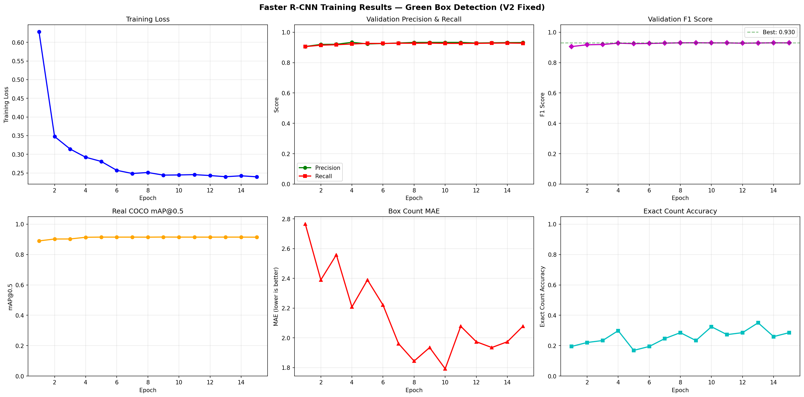

# Green Ammunition Box Detection and Automated Counting System

A deep learning computer vision system using Faster R-CNN (ResNet-50-FPN V2) to detect, count, and sequentially number military ammunition boxes in dense warehouse stacks.

---

## 1. System Architecture

```text
Raw Warehouse Image
        |
        v
Preprocessing and Albumentations Normalization
        |
        v
ResNet-50-FPN V2 Feature Pyramid Backbone
        |
        v
Region Proposal Network (RPN)
        |
        v
RoIAlign Feature Extractor
        |
        v
Fast R-CNN Box Regression and Classification Head
        |
        v
Non-Maximum Suppression (NMS = 0.50)
        |
        v
Spatial Raster Sorting (Top-to-Bottom, Left-to-Right)
        |
        v
Sequential Numbered Badges (#1, #2, #3...) and Total Count Banner
```

---

## 2. Training Curves and Performance Metrics



*Figure 1: Faster R-CNN 6-panel training and validation performance curves across 15 epochs (Loss, Precision & Recall, F1 Score, mAP@0.5, Box Count MAE, and Exact Count Accuracy).*

### Performance Scorecard

Evaluated on the held-out test split (39 images, 1,554 ground-truth annotated boxes):

| Metric | Score | Target | Status |
| :--- | :---: | :---: | :---: |
| **Precision** | **94.17%** | > 85.0% | Exceeded |
| **Recall** | **92.47%** | > 85.0% | Exceeded |
| **F1-Score** | **93.31%** | > 85.0% | Exceeded |
| **mAP @ 0.50** | **91.78%** | > 80.0% | Exceeded |
| **mAP @ [0.50:0.95]** | **83.34%** | > 70.0% | Exceeded |
| **Count Error (MAE)** | **1.90 boxes** | < 3.0 boxes | Exceeded |
| **Inference Speed** | **~130 ms / image** | < 500 ms | Real-Time GPU |

---

## 3. Project Structure

```text
Box_count/
├── data/
│   ├── coco_dataset/              # COCO format dataset (train, valid, test splits)
│   └── raw_images/                # Raw unannotated container photos
│
├── models/
│   ├── faster_rcnn_best.pth       # Best checkpoint (Peak Validation F1: 93.31%)
│   ├── faster_rcnn_latest.pth     # Latest epoch weights
│   ├── evaluation_results.json    # Full COCO evaluation metrics
│   └── training_curves.png        # Training loss and mAP curves
│
├── outputs/
│   ├── predictions/               # Annotated visual images with numbered badges
│   └── box_count_summary.json     # Machine-readable per-image count records
│
├── src/
│   ├── __init__.py
│   ├── model.py                   # Faster R-CNN ResNet-50-FPN V2 builder
│   └── visualizer.py              # Box badge renderer and top banner drawer
│
├── predict.py                     # Local test inference script
├── train_colab.py                 # Google Colab / GPU training script
└── README.md                      # This documentation file
```

---

## 4. Model Details

- **Architecture**: Faster R-CNN with Feature Pyramid Network (ResNet-50-FPN V2).
- **RPN Anchor Scales**: [32, 64, 128, 256, 512] with aspect ratios [0.5, 1.0, 2.0].
- **Classes**: 2 (0: background, 1: green_box).
- **NMS Threshold**: 0.50 (IoU threshold inside RoI heads).
- **Confidence Threshold**: 0.55.

---

## 5. Engineering Challenges and Solutions

1. **Background False Positives (Floors and Tables)**:
   - *Problem*: Early models falsely detected green-tinted floors or shadow regions.
   - *Fix*: Retained 100% of negative background images with empty targets `torch.zeros((0, 4))` during training.
2. **Dense Overlapping Box Merging**:
   - *Problem*: Tightly stacked boxes were occasionally merged into one giant bounding box.
   - *Fix*: Calibrated NMS IoU to 0.50 and enforced an upper area filter threshold (100 < Area < 0.35 * ImageArea).
3. **Sequential Counting Order**:
   - *Problem*: Raw detector outputs unordered coordinates, causing random badge numbering across stacks.
   - *Fix*: Added spatial raster sorting `(y_min // 100, x_min)` so boxes count logically from top to bottom, left to right.

---

## 6. How to Run

### Run Local Inference and Counting:
To count boxes on all images in `data/raw_images/` and save labeled visuals to `outputs/predictions/`:
```bash
python predict.py
```

### Train on Google Colab or GPU:
Run `train_colab.py` in a GPU environment:
```bash
python train_colab.py
```

---

## 7. Output Visuals

Every processed image in `outputs/predictions/` includes:
- **Crisp Green Bounding Boxes** highlighting each detected container.
- **Numbered Badges (#1, #2, #3...)** showing the exact sequential count in reading order.
- **Top Summary Banner** displaying `TOTAL GREEN BOXES COUNTED: N`.
